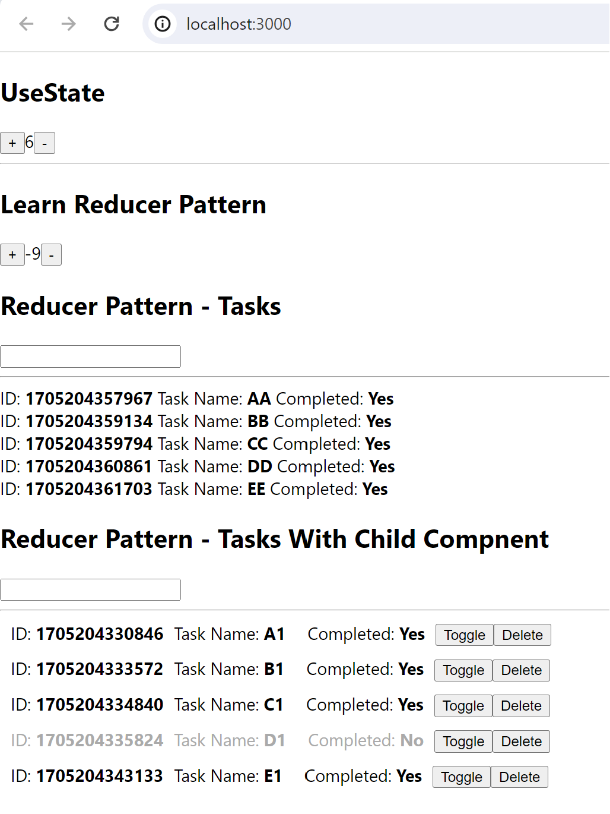
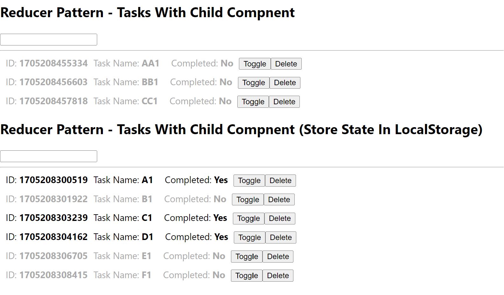
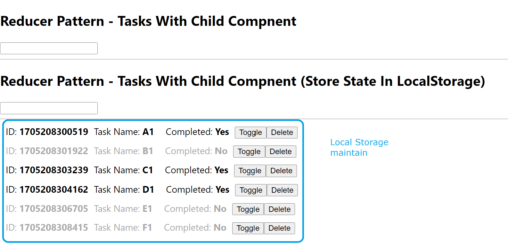
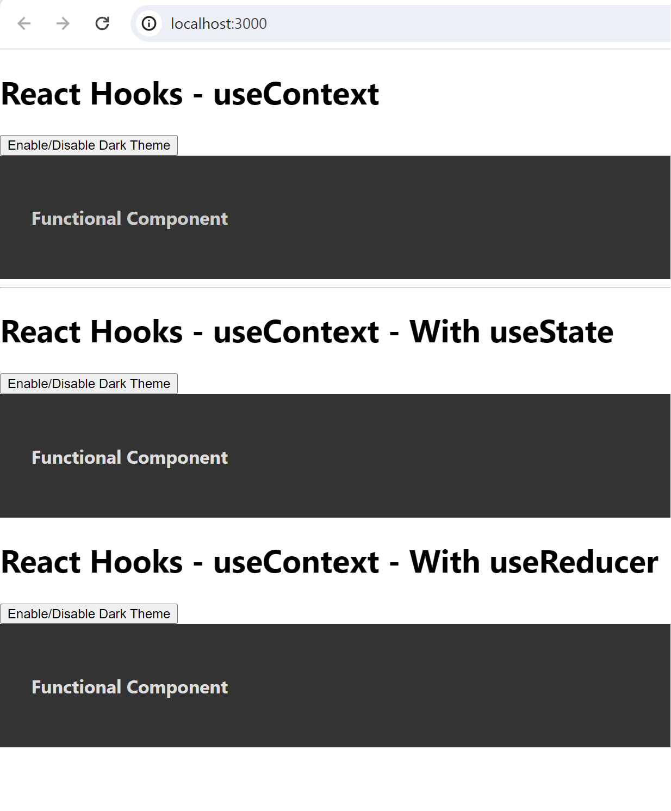

# Topics

This is my learning React Hooks Project.

# VS Code Github Setup

Install extensions:
GitHub Repositories
GitHub Codespaces
GitHub Pull Requests and Issues

# Reducer

App Create => npx create-react-app reducer

Steps:

1. Run: npm start
   Output
   

2. Use Local Storage
   
   In another browser
   

#---------------------------------------
Hooks: useContext: Context is for passing down props essentially all the way down into any o fthe children without actually having to manually pass.
It's like a global state of all the child components
Instead of sending complext props into child use Context
Mainly used in module type components like (Article, Blog,etc..) to pass the parent state into child components.
Output:

